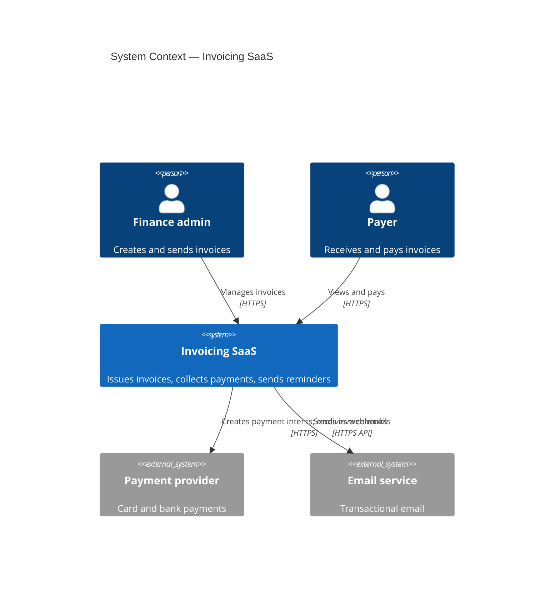
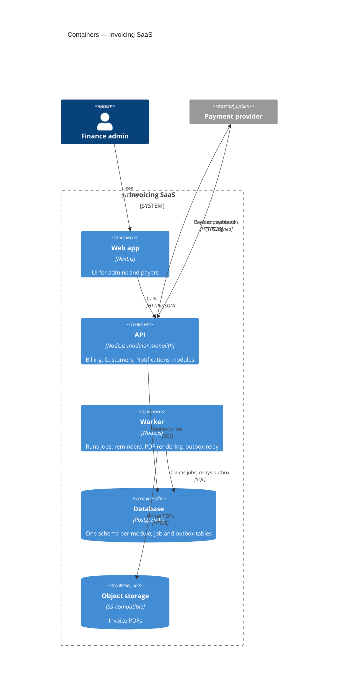
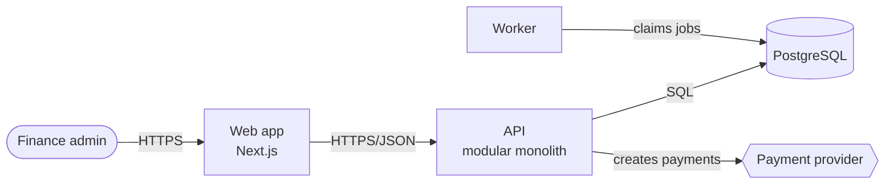

# ADRs, C4 Diagrams, and Fitness Functions

Three tools that keep architecture explicit: decision records explain *why*, diagrams show *what*, fitness functions check *that it stays true*.

## Contents
1. When a decision deserves an ADR
2. ADR format and conventions
3. C4 model levels
4. Mermaid C4 examples
5. Fitness-function catalog
6. Rules catalog

## 1. When a decision deserves an ADR

Write one when the decision is **architecturally significant and costly to reverse**:

- New datastore, cache, broker, search engine, or vector store.
- Splitting out a service, or merging services back.
- Public API style or versioning scheme; event contract format.
- Authentication/authorization model; tenancy model.
- Framework or language for a major component; build/monorepo tooling.
- A conscious shortcut (e.g., ORM annotations inside the domain, cross-schema foreign keys) that others will question later.

Skip it for reversible, local, or style-guide-covered choices (a helper's name, folder order inside a module, a lint rule).

Before writing, look for the existing convention: `git ls-files | grep -iE '(adr|decisions?)/'`. Follow its numbering and template. If none exists, create `docs/adr/` and start at `0001-record-architecture-decisions.md`.

## 2. ADR format and conventions

- File name: `NNNN-imperative-title.md` — e.g., `0007-use-postgres-for-job-queue.md`.
- Status: `proposed` → `accepted` | `rejected`; later `deprecated` or `superseded by 0012`.
- ADRs are immutable once accepted. To change a decision, write a new ADR that supersedes it and update only the old one's status line.
- Keep them short (one screen). Link to deeper design docs rather than copying them.
- An agent that proposes a one-way-door change drafts the ADR with status `proposed` and asks the user to accept it.

Template: `assets/adr-template.md` (Nygard's sections plus MADR-style options and a confirmation line).

A **Y-statement** is a useful one-line summary at the top:

> In the context of *nightly invoice generation*, facing *a need for retries and visibility without new infrastructure*, we decided for *a Postgres-backed job queue* and against *Redis + BullMQ*, to achieve *transactional enqueue and one less system to run*, accepting *lower peak throughput than a dedicated broker*.

## 3. C4 model levels

| Level | Shows | Audience | Draw it? |
|---|---|---|---|
| 1. System context | Your system as one box, its users, external systems | Everyone | Always |
| 2. Container | Deployable/runnable units and data stores: web app, API, worker, DB, queue, object storage | Developers, ops | Always for >1 container |
| 3. Component | Major components/modules inside one container | Developers of that container | Only for complex containers |
| 4. Code | Classes/functions | — | Generate from code if ever needed; never hand-maintain |

Supplementary diagrams: dynamic (a numbered flow for one use case), deployment (containers mapped to infrastructure), system landscape (many systems).

Diagram rules:
- Every diagram has a title and a scope.
- Every element has a name, a type/technology, and a one-line responsibility.
- Every relationship is labeled with intent and protocol: "publishes InvoicePaid via outbox relay", "reads/writes (SQL)".
- Keep diagrams as code next to the source (Mermaid in Markdown, Structurizr DSL, or PlantUML C4) so they change in the same pull request.

## 4. Mermaid C4 examples

Mermaid's C4 support renders in GitHub and many Markdown tools. Its syntax is still marked experimental, so if a renderer rejects it, fall back to a `flowchart` with the same boxes and labels.

**Level 1 — system context**

**Level 2 — containers**

**Fallback flowchart**

## 5. Fitness-function catalog

A fitness function is an automated, objective check of an architectural characteristic. Start with the first two rows; add others when the characteristic is a stated driver.

| Characteristic | Fitness function | Tools (examples) | When it runs |
|---|---|---|---|
| Module boundaries | Forbidden imports; public-API-only access | dependency-cruiser, eslint-plugin-boundaries, Nx, import-linter, ArchUnit, Spring Modulith, Konsist, Packwerk | CI |
| No cycles | Cycle detection between modules/packages | Same as above | CI |
| Layering | Domain imports no framework/driver | Same as above | CI |
| Migration safety | Lint schema migrations for locking operations | squawk, strong_migrations | CI |
| Performance | p95 latency threshold under load; bundle size limits | k6, Gatling, size-limit, Lighthouse CI | CI / nightly |
| Security | Dependency audit, secret scanning, SAST, SBOM | npm/pip audit, gitleaks, Semgrep, CodeQL | CI |
| Operability | Every service exposes health checks, RED metrics, trace propagation | Contract test or startup check | CI |
| Availability / latency | SLO burn-rate alerts | Prometheus/Grafana, vendor APM | Continuous (production) |
| Cost | Budget and anomaly alerts per service/tenant | Cloud cost tooling | Continuous |

Write fitness functions as code in the repo and make them required checks; one that only runs on someone's laptop does not count.

## 6. Rules catalog

### Draft an ADR for every one-way door
**Rule.** When you propose a costly-to-reverse change, write a short ADR with status `proposed` and ask the user to accept it.
**Apply when.** New infrastructure, service split, public contract style, auth or tenancy model.
**Do / Avoid.** Do: `docs/adr/0009-extract-media-processing-service.md` with context, options, consequences. Avoid: silently adding Redis in a feature PR.
**Why.** Future maintainers inherit the decision without the conversation; the record prevents re-litigating it and exposes accepted downsides.

### Supersede, never edit, accepted ADRs
**Rule.** Record changed decisions as new ADRs that reference the old one.
**Apply when.** A past decision no longer holds.
**Do / Avoid.** Do: `0014 — replace Postgres queue with SQS (supersedes 0007)`. Avoid: rewriting 0007 to say SQS.
**Why.** The history of why things changed is itself valuable context; edited ADRs erase it.

### Keep diagrams as code beside the source
**Rule.** Write C4 diagrams in Mermaid or Structurizr in the repo and update them in the same PR as the change.
**Apply when.** Adding or removing a container, datastore, or external dependency.
**Do / Avoid.** Do: update the container diagram in `docs/architecture.md` when adding a worker. Avoid: a stale PNG exported from a whiteboard tool.
**Why.** Diagrams outside version control drift immediately and mislead more than they help.

## Sources

- Michael Nygard, Documenting Architecture Decisions: https://cognitect.com/blog/2011/11/15/documenting-architecture-decisions
- joelparkerhenderson, architecture-decision-record (templates and ADR skill): https://github.com/joelparkerhenderson/architecture-decision-record
- MADR: https://adr.github.io/madr/
- Y-statements: Zdun, Capilla, Tran, Zimmermann, "Sustainable Architectural Design Decisions" (IEEE Software, 2013)
- Simon Brown, The C4 model: https://c4model.com/ ; InfoQ article: https://www.infoq.com/articles/C4-architecture-model/
- Mermaid C4 diagrams: https://mermaid.js.org/syntax/c4.html
- Ford, Parsons, Kua, Sadalage, Building Evolutionary Architectures, 2nd ed. (fitness functions): https://www.oreilly.com/library/view/building-evolutionary-architectures/9781492097532/ch04.html
