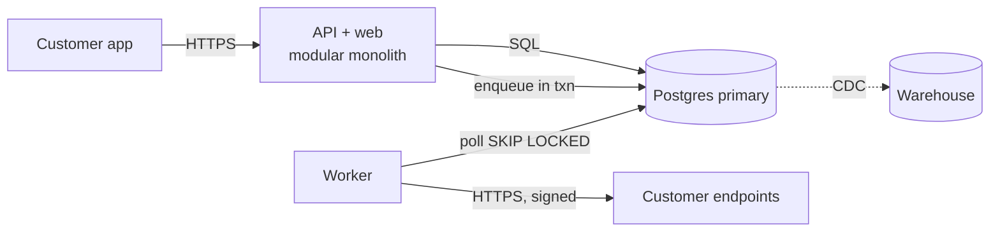

# The System Design Method — Step by Step

The 13 steps from `SKILL.md`, with the questions to ask, what a good output looks like, and a worked example. The skeleton follows the common interview format (requirements → estimation → data → API → high-level → deep dive → bottlenecks), extended with what real designs need and interviews skip: the existing system, invariants, alternatives, rollout, and operations.

## Contents
1. How real design differs from the interview format
2. Steps 1–5: understand before drawing
3. Steps 6–8: shape the system
4. Steps 9–10: go where the risk is
5. Steps 11–13: decide, ship, operate
6. Diagrams
7. Worked example: outbound webhooks for a B2B SaaS
8. Rules catalog

## 1. How real design differs from the interview format

| Interview habit | Real-world correction |
|---|---|
| Blank slate | The existing system, its data, and its contracts are the starting point; most published cases (Discord, Figma, Notion, Slack, GitHub, Stripe) are migrations |
| "Scale to a billion users" | Design for measured load and 12–24 months of growth, with written trigger points for the next step |
| The "expected" answer (microservices, sharding, CQRS) | Often wrong for real constraints — Stack Overflow ran on a monolith and a few SQL Servers |
| Boxes first | Access patterns and invariants first; the diagram falls out of them |
| Ends at the diagram | Ends at a rollout plan, alerts, an owner, and a cost estimate |

## 2. Steps 1–5: understand before drawing

### Step 1 — Problem and context
- What event or metric triggers this work (incident, growth curve, product bet, cost)?
- What happens if we do nothing for six months?
- What exists today: code paths, tables and their sizes, external contracts (APIs, webhooks, SDKs, files), current QPS and error rates?
- Who is affected — users, internal teams, partners?

Good output: "Invoice PDF generation runs inside the request and times out for invoices over ~300 lines (Measured: 2% of requests, p99 28 s). Customers retry and create duplicates. We need generation to complete for invoices up to 5,000 lines without blocking the request."

### Step 2 — Functional requirements and non-goals
- Number each behavior (FR1, FR2…) so later sections can reference it.
- Non-goals are things a reasonable reader would assume are included: "NG1: no custom templates in this phase."
- Mark nice-to-haves separately; they are the first thing cut.

### Step 3 — Non-functional requirements
- Per operation: latency (p50/p99), availability, consistency, durability (RPO), recovery time (RTO).
- Data: retention, PII categories, residency, deletion deadline, audit needs.
- Security: who may do what (authorization model), tenant isolation.
- Cost ceiling: monthly or per unit.
- Ask explicitly: "Which operations must never show stale data or double-apply?" — usually money, inventory, permissions, and uniqueness.

### Step 4 — Estimates
- DAU → actions/user/day → average rps → peak (× 3 if unknown).
- Read:write ratio; payload sizes; storage per year × retention × index overhead.
- The largest tenant / hottest key and its share of traffic.
- Label every number Estimated or Measured. Formulas: `scalability` → `references/numbers.md`; data sizing: `references/estimation.md`.

### Step 5 — Access patterns and invariants
- List the top 5–10 reads and writes with frequency, latency need, and shape ("by id", "by tenant newest first", "aggregate by month").
- Separate OLTP patterns from analytics; analytics goes to a replica or warehouse, never shapes the primary schema.
- List invariants and classify each:

| Enforcement | Examples |
|---|---|
| Database constraint | Uniqueness, foreign keys, non-negative amounts, no overlapping bookings |
| Single transaction | Order total equals its lines; debit and credit legs balance |
| Eventual + reconciliation | Every paid order ships once; search index matches the source; cross-service balances |

If an invariant spans services, name the reconciliation job and how discrepancies are alerted.

## 3. Steps 6–8: shape the system

### Step 6 — Data model
- Entities, keys, relationships, constraints; which module owns (writes) each table.
- Partition key only if estimates require it — pick it from the dominant access pattern and bound partition size (entity + time bucket for unbounded streams, as Discord did with channel + time window).
- Every denormalized field names its source of truth and sync mechanism.
- Table-level design, keys, and migrations: `data-modeling`.

### Step 7 — API sketch
- List operations as `VERB /path` or command/event names with request and response shapes.
- For each write: idempotent by nature, or requires an idempotency key?
- For each list: pagination (cursor), maximum page size, sort order.
- For each event: name in past tense, key for ordering, schema version.
- Details: `api-design`.

### Step 8 — High-level design
- Start from one deployable + one database + one worker. Add a component only by pointing at a requirement or estimate it satisfies.
- Show synchronous and asynchronous edges differently; label each edge with protocol and whether it is on the user's critical path.
- Mark which components hold state; stateless tiers scale by copies, stateful ones need a plan.

## 4. Steps 9–10: go where the risk is

### Step 9 — Deep dives
Pick 2–4 by risk, not comfort:
- Highest write contention (hot rows, counters, global locks).
- The most complex consistency boundary (cross-service workflow, money movement).
- The biggest unknown (new technology, unmeasured dependency, third-party limits).
- The largest data movement (backfill, migration, re-index).

For each: a sequence of the happy path and at least two failure paths (timeout mid-way, duplicate delivery, crash between steps). Say what the user sees in each.

### Step 10 — Bottlenecks and failure modes
Walk each component and ask: what if it is slow, down, wrong, or overloaded?
- Single points of failure: one primary, one queue, one region, one credential.
- Hard limits: 32-bit IDs, connection limits, provider rate limits, file-size caps, partition size.
- Retry storms: which callers retry, and do they back off with jitter and a cap?
- Blast radius: which users or tenants are affected by each failure?

## 5. Steps 11–13: decide, ship, operate

### Step 11 — Trade-offs and alternatives
- Always include: **do nothing / smallest change**, **boring off-the-shelf** (managed service, existing database feature), and the chosen design.
- Compare on the requirements from steps 2–4, not on generic pros and cons.
- Write key decisions in the trade-off sentence form; each one-way door becomes an ADR.

### Step 12 — Rollout and migration
- Phases with entry and exit criteria; feature flags per phase; dual-write/shadow-read; backfill plan; comparison metrics; rollback at every phase; cleanup phase with a date.
- Patterns and templates: `references/migrations-and-rollouts.md`.

### Step 13 — Operations
- SLIs that match the SLOs from step 3; alerts on burn rate, queue age, replication lag, percent-to-limit.
- Dashboards: one per critical flow.
- Runbook: the top three failure modes from step 10 with first actions.
- Owner (team and on-call rotation) and monthly cost estimate.

## 6. Diagrams

Default: C4 level 1 (system context) and level 2 (containers) in Mermaid, kept next to the doc. Sequence diagrams for the 2–3 key flows including a failure path.

Rules: label every edge with protocol and sync/async; one diagram per level; no vendor logos as decoration; update the diagram when the design changes.

## 7. Worked example: outbound webhooks for a B2B SaaS

**1. Problem.** Customers poll our API every minute to detect invoice changes (Measured: 40% of API traffic). We want to push events instead.

**2. FRs.** FR1 customers register HTTPS endpoints per event type; FR2 we deliver signed events within 1 min of the change; FR3 retries for up to 3 days; FR4 a delivery log and manual replay. **Non-goals:** ordering guarantees across different invoices; custom payload shapes.

**3. NFRs.** Delivery p95 < 60 s after commit; at-least-once; no event lost if the app crashes after commit; one slow customer must not delay others; payloads contain no card data.

**4. Estimates (Estimated).** 2M events/day ≈ 23/s average, ~70/s peak; largest tenant ≈ 15% of events; payload ~2 KB → ~4 GB/day of delivery log, 30-day retention ≈ 120 GB plus indexes.

**5. Access patterns and invariants.** AP1 enqueue on invoice change (same transaction as the change); AP2 claim due deliveries; AP3 list deliveries for an endpoint, newest first. I1 an event exists iff the change committed → outbox row in the same transaction; I2 each (event, endpoint) delivered until 2xx or expiry → idempotent delivery with an event ID the receiver dedupes on.

**6–8. Data, API, topology.** `outbox_events` and `webhook_deliveries (tenant_id, endpoint_id, event_id, status, attempt, next_attempt_at)` in Postgres, partitioned by day for cheap retention; a worker claims rows with `FOR UPDATE SKIP LOCKED` ordered by `next_attempt_at`; per-tenant concurrency cap for fairness. No broker: 70/s is far within one Postgres.

**9. Deep dive.** Fairness: a customer endpoint timing out at 30 s × many deliveries could starve others → 10 s timeout, per-endpoint concurrency 4, circuit-break an endpoint after N consecutive failures and back off exponentially with jitter.

**10. Failure modes.** Worker crash mid-send → lease expires, row retried, receiver dedupes by event ID. Postgres down → nothing commits, nothing to send. Endpoint returns 410 → disable endpoint and notify the customer.

**11. Trade-off.** "We choose a Postgres-backed queue over a managed broker because 70/s peak and transactional enqueue matter more than broker features; costs some DB load; revisit if deliveries exceed ~1k/s sustained or a second consumer needs replay."

**12. Rollout.** Phase 1: write outbox rows, no delivery (verify volume). Phase 2: deliver to internal test endpoints. Phase 3: opt-in beta tenants behind a flag, compare with polling. Phase 4: general availability. Rollback: flag off stops delivery; outbox keeps accumulating for replay.

**13. Operations.** SLI: share of deliveries attempted within 60 s of commit; alert on age of oldest due delivery; dashboard per endpoint health; owner: Integrations team.

## 8. Rules catalog

### Gate the diagram on written access patterns
**Rule.** Do not draw the high-level design until problem, requirements, estimates, access patterns, and invariants are written.
**Apply when.** Any design larger than a single-module change.
**Do / Avoid.** Do: list AP1–AP5 and I1–I4, then derive tables and components. Avoid: opening with "API gateway → microservices → Kafka".
**Why.** Components chosen before the data shape force the schema to fit the boxes; access patterns decide keys, indexes, and partitioning.

### Include the smallest change as an alternative
**Rule.** Every alternatives table contains "do nothing / smallest change" and "boring off-the-shelf".
**Apply when.** Writing section 11 of any design.
**Do / Avoid.** Do: "Add an index and a cache header — rejected because p99 is dominated by PDF rendering, not queries." Avoid: comparing only three distributed designs.
**Why.** It forces the design to justify its cost against the cheapest option; often the cheap option wins (Segment, Prime Video).

### Follow failure paths in every deep dive
**Rule.** Each deep-dive flow shows at least two failure paths and what the user sees.
**Apply when.** Step 9.
**Do / Avoid.** Do: "crash after charge, before recording → idempotency key replays the stored result." Avoid: happy-path-only sequence diagrams.
**Why.** Partial failure between steps is where distributed systems lose or duplicate data.

## Sources

- Malte Ubl, "Design Docs at Google": https://www.industrialempathy.com/posts/design-docs-at-google/
- karanpratapsingh/system-design (method and interview structure): https://github.com/karanpratapsingh/system-design
- Google SRE Book, Service Level Objectives: https://sre.google/sre-book/service-level-objectives/
- Simon Brown, C4 model: https://c4model.com/
- Nick Craver, "Stack Overflow: The Architecture – 2016 Edition": https://nickcraver.com/blog/2016/02/17/stack-overflow-the-architecture-2016-edition/
- Discord, "How Discord Stores Trillions of Messages": https://discord.com/blog/how-discord-stores-trillions-of-messages
- Prime Video Tech, monitoring service cost reduction: https://www.primevideotech.com/video-streaming/scaling-up-the-prime-video-audio-video-monitoring-service-and-reducing-costs-by-90
- Brandur Leach, "Implementing Stripe-like Idempotency Keys in Postgres": https://brandur.org/idempotency-keys
